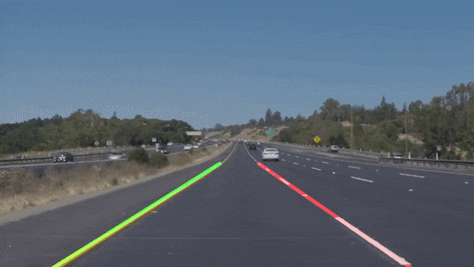

# **Finding Lane Lines on the Road** 

[//]: # (Image References)

---

## Reflection

### The lane-identification pipeline

1. I first mark off a region of interest (ROI) which masks the parts of the images that we are not interested in. This is done by drawing a polygon that is roughly the outline of where the lane lines would be expected to be for the given camera position.
2. It then converts the image to hue-saturation-value (HSV) color space. This is because it makes it a lot easier to identify certain hues of color, which is defined by one value instead of the combination of three in red-green-blue (RGB). For instance, white has a value of 0 (easy enough) and yellow is around 25. I then filter out pixels that are not within a range around these colors, leaving us with just the white and yellow lane lines.
3. The image is then converted into grayscale, which is needed for Canny edge detection
4. A Gaussian blur is added which aids in Canny edge detection
5. Canny edge detection is performed, which leaves a 1 pixel line around sharp edges. This outlines the lane lines in the image.
6. A Hough transform is applied, which calculates all the possible linear lines for each point in our edge-detected image, and then selects the lines that go through the most points, which follows our lane lines.
7. The draw line function uses these Hough transform lines to make the final solid lines.
    1. For each of these lines, we calculate the average x1, x2, y1, y2
    2. If we're left of the centerpoint, we consider it the left line. If we're right of it, the right lines.
    3. For each side, the slope is calculated, then used to extend the lane line up and down from the detected lane.
    4. Draw the line.

### 2. Potential shortcomings
* The most obvious shortcoming is that the current algorithm doesn't respond well to changes in conditions. Different lighting conditions, road types, etc. are not taken into account. 
* The region of interest is not algorithmically set. One way of doing this would be horizon detection.
* Similarly, sharp curves in the road would not work. The current algorithm only detects straight lines.

### 3. Possible improvements 
* The first improvement I would make would be to have no user-set constants, and to calculate everything based on the given image.
* Another improvement would be to smooth out consecutive drawings and remove noise from measurements.
